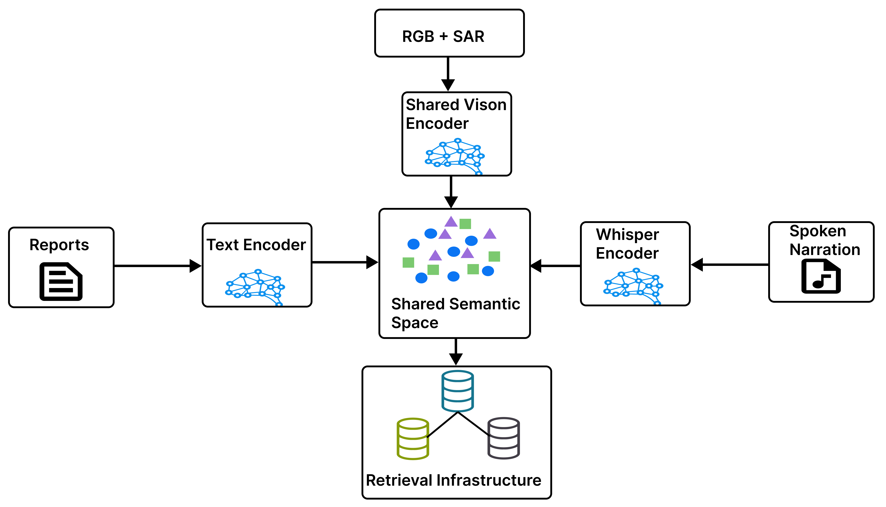
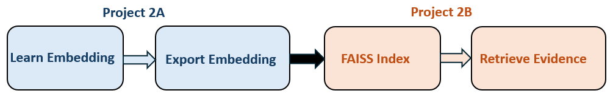
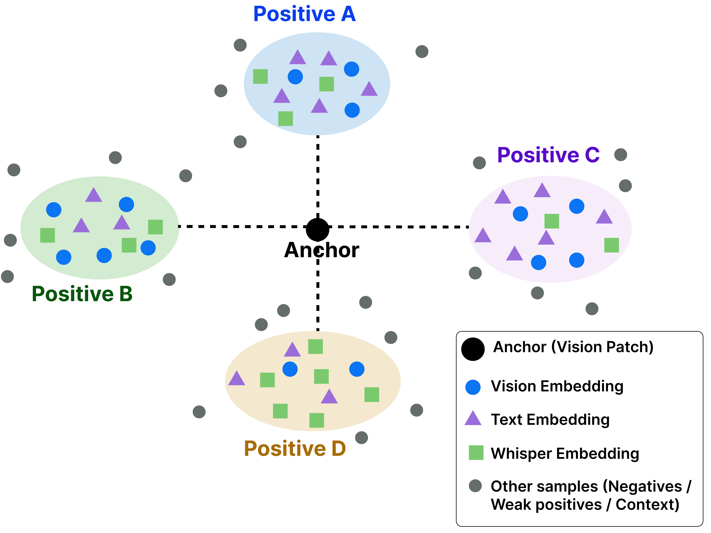
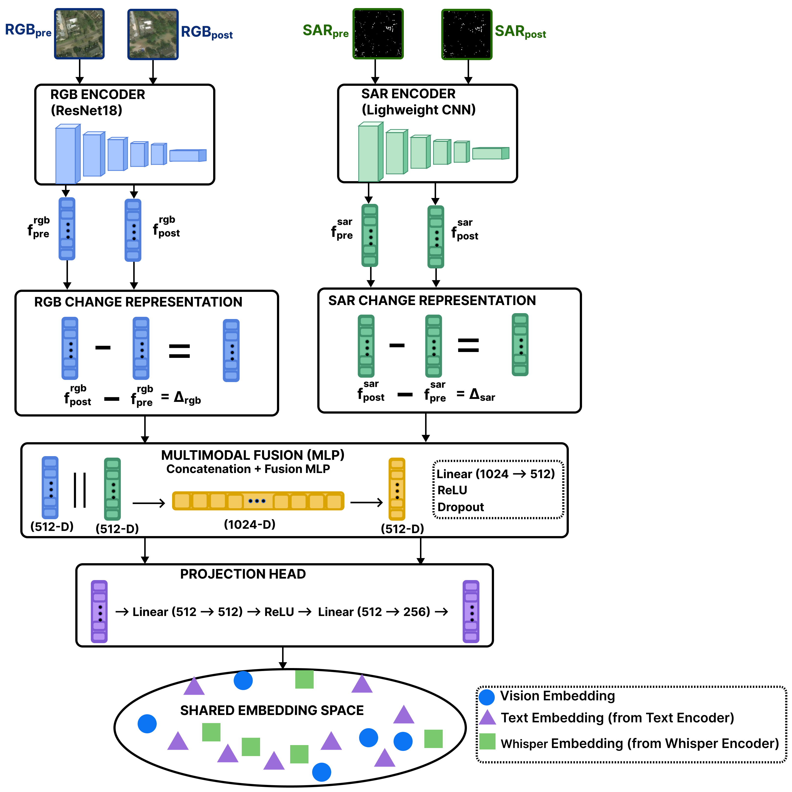
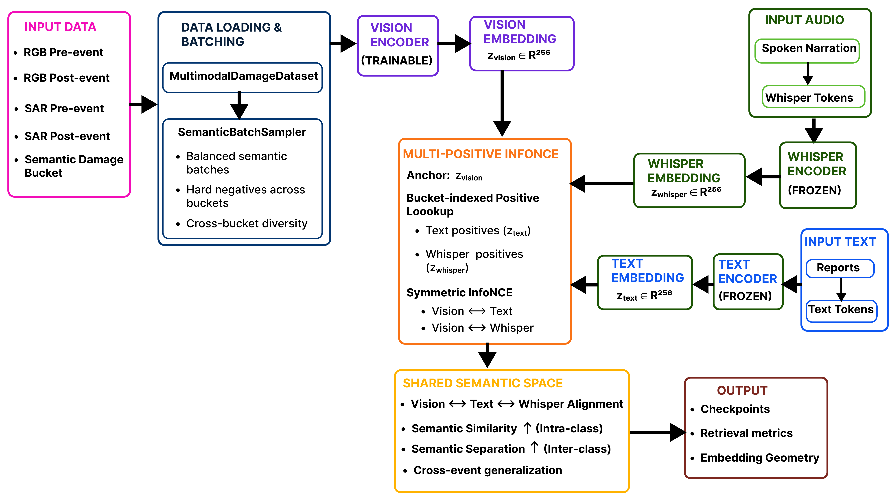
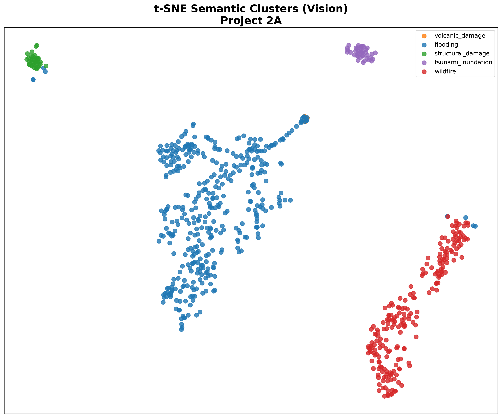
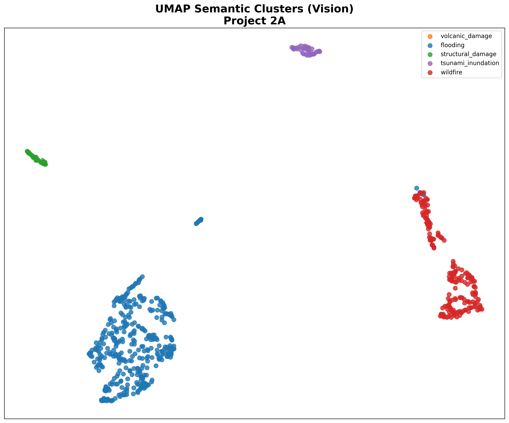
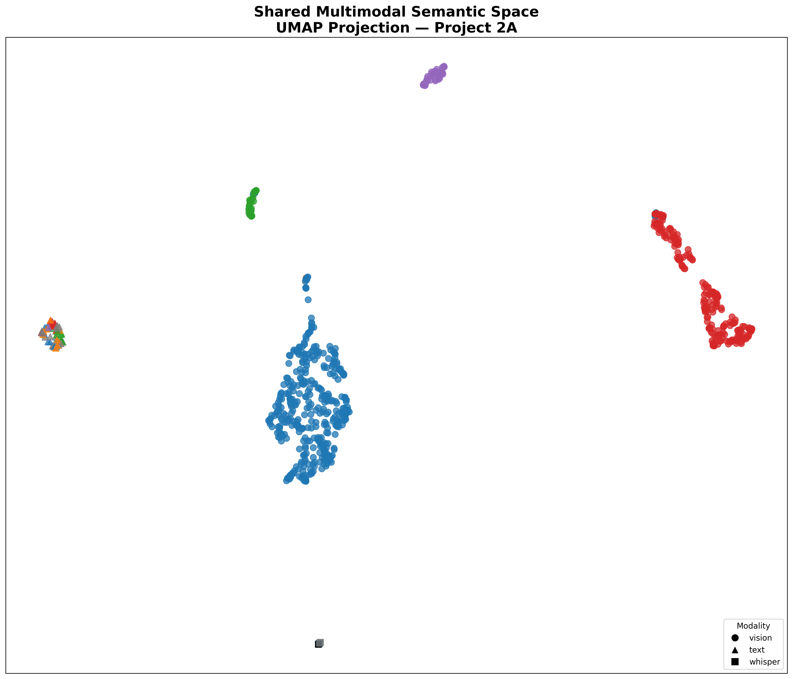

# Project 2A

Multimodal Semantic Representation Learning
for Disaster Retrieval

<div align="center">

[]()
[]()
[]()
[]()
[]()

</div>

---

# High-Level System Architecture


**Figure 1. Project 2A Architecture.** RGB/SAR change representations are aligned with textual and spoken disaster descriptions through multi-positive contrastive learning to learn a shared semantic embedding space.

---

# Overview

Project 2A is a multimodal contrastive retrieval system that aligns:

- RGB disaster imagery
- Sentinel-1 SAR imagery
- disaster reports
- spoken disaster narration

into a shared semantic embedding space for:

- cross-modal retrieval
- semantic search
- nearest-neighbor retrieval
- cross-event generalization
- retrieval-oriented representation learning

The system learns semantic alignment between visual disaster patterns and language-based disaster descriptions using multimodal contrastive learning.

Unlike traditional supervised systems focused on classification, Project 2A emphasizes:

- semantic embedding geometry
- multimodal representation learning
- retrieval-oriented alignment
- shared semantic manifolds
- vector-search infrastructure

The project serves as the representation-learning foundation for downstream multimodal retrieval and RAG systems.

---

# Why Retrieval Matters

Traditional supervised systems answer:

```text
"What class is this?"
```

Project 2A instead focuses on:

```text
"What semantically similar disasters exist?"
```

This shifts the objective from:
- classification
to:
- semantic retrieval

The system is therefore designed for:
- multimodal semantic search
- nearest-neighbor retrieval
- vector databases
- retrieval-augmented reasoning

---

# Core Idea

The system learns a shared semantic space where semantically related multimodal samples become geometrically nearby.

| Vision Input | Semantic Alignment |
|---|---|
| flooded neighborhoods | flooding reports |
| collapsed buildings | structural-damage narration |
| wildfire destruction | wildfire descriptions |
| tsunami inundation | tsunami reports |

This enables:

```text
Vision ↔ Language Retrieval
```

instead of only:

```text
classification
```

---

# Objectives

| Objective | Description |
|---|---|
| semantic alignment | align modalities into shared geometry |
| cross-event retrieval | learn generalized disaster semantics |
| multimodal retrieval | enable vision ↔ language retrieval |
| retrieval infrastructure | export reusable embeddings |
| representation learning | learn shared semantic manifolds |

---

# Key Contributions

- Multimodal RGB + SAR + language alignment
- Cross-event semantic retrieval learning
- Multi-positive contrastive supervision
- Shared hyperspherical embedding geometry
- Retrieval-ready embedding export pipeline
- Embedding geometry diagnostics
- Weak semantic supervision using damage buckets
- Layer4 semantic finetuning strategy
- Bidirectional contrastive alignment:
  - vision → language
  - language → vision

---

# Key Technical Features

| Area | Implementation |
|---|---|
| Vision backbone | ResNet18 |
| Vision modalities | RGB + SAR |
| Language encoder | DistilBERT |
| Training objective | Symmetric InfoNCE |
| Retrieval space | Shared semantic hypersphere |
| Embedding dimension | 256 |
| Similarity metric | Cosine similarity |
| Finetuning strategy | Layer4 + projection head |
| Positive supervision | Multi-positive semantic pools |
| Retrieval infrastructure | Exported vector artifacts |

---

# Final Recommended Configuration

| Component | Final Choice |
|---|---|
| finetuning mode | `layer4` |
| positive supervision | `multi` |
| semantic alignment | bidirectional |
| retrieval space | normalized embeddings |
| checkpoint selection | `epoch10` |

This configuration was selected based on retrieval quality,
embedding geometry, and training stability.

---

# Embedding Geometry

All modalities are aligned into a shared semantic embedding manifold:

- vision embeddings
- report embeddings
- narration embeddings

After L2 normalization:

$$\lVert z \rVert = 1$$

all embeddings lie on a shared hypersphere where:

$$\cos(a,b) = a^\top b$$

Semantic similarity is therefore encoded directly into geometric proximity.

---

# Final Retrieval Artifacts

```text
2A/artifacts/layer4_multi/

├── metadata.json
├── vision_embeddings.npy
├── vision_index.json
├── text_embeddings.npy
├── text_index.json
├── whisper_embeddings.npy
└── whisper_index.json
```

These artifacts establish the bridge between:

```text
Project 2A → Representation Learning
Project 2B → Retrieval Infrastructure
```

---

## Bridge to Project 2B



**Figure 2. Representation Learning → Retrieval Infrastructure.**
Project 2A learns multimodal semantic embeddings and exports retrieval-ready artifacts. Project 2B builds retrieval infrastructure on top of these embeddings through FAISS indexing and evidence retrieval.

Project 2A focuses on representation learning, while Project 2B operationalizes these embeddings through indexing, retrieval, evidence routing, and retrieval evaluation.


---

# Why Multimodal Retrieval?

Modern disaster-response systems increasingly require understanding across multiple modalities:

- satellite imagery
- radar imagery
- written reports
- spoken narration

Traditional RGB-only systems are limited because they primarily learn:
- visual appearance
rather than:
- generalized semantic understanding

Project 2A addresses this through multimodal contrastive representation learning.

The system learns a shared semantic embedding space where:
- visual disaster patterns align with language semantics
- semantic similarity generalizes across events
- retrieval becomes possible across modalities

---

# Why RGB Alone Is Insufficient

RGB imagery alone has several limitations during disaster analysis:

| Limitation | Impact |
|---|---|
| cloud sensitivity | obscured observations |
| lighting dependence | unstable appearance |
| weak structural awareness | missed deformation |
| poor nighttime robustness | limited temporal visibility |

---

# SAR Complements RGB

Sentinel-1 SAR imagery provides complementary information unavailable in RGB imagery.

| SAR Capability | Benefit |
|---|---|
| cloud penetration | all-weather sensing |
| radar scattering | structural awareness |
| deformation sensitivity | disaster change detection |
| illumination invariance | stable observation |

---

# Cross-Event Retrieval

A major goal of Project 2A is:

```text
semantic similarity across disaster events
```

rather than:
```text
event memorization
```

Examples:

| Query | Desired Retrieval |
|---|---|
| Hurricane Harvey flood image | Midwest flooding report |
| collapsed building imagery | structural-damage narration |
| wildfire patch | wildfire report fragment |

This encourages:
- semantic invariance
- cross-event generalization
- retrieval robustness

---

# Real Cross-Event Retrieval Examples

The learned embedding space retrieves semantically related disasters across different events rather than memorizing a single disaster instance.

## Flooding Retrieval


## Wildfire Retrieval


These examples demonstrate:
- semantic generalization
- cross-event retrieval
- disaster-type manifold learning
- retrieval-oriented embedding geometry

---


# Dataset & Modalities

Project 2A combines:

| Modality | Source | Role |
|---|---|---|
| RGB | xView2 | visual appearance |
| SAR | Sentinel-1 | structural change |
| Reports | web reports | formal semantics |
| Whisper | ASR narration | spoken semantics |

---

## Data Dependency

Project 2A uses the normalized RGB and SAR imagery
produced by Project 1. No additional image
preprocessing is performed within Project 2A.

This project begins from the normalized multimodal
dataset and focuses exclusively on multimodal
representation learning and retrieval.

The complete preprocessing pipeline, including RGB
normalization, SAR normalization, dataset validation,
and TFRecord generation, is documented in the
Project 1 repository.

---

# Temporal Setup

The system uses:

- pre-disaster imagery
- post-disaster imagery

to capture:
- disaster-induced change
- structural transformation
- environmental damage

---

# Semantic Supervision Strategy

Project 2A uses:

```text
weak semantic supervision
```

through:
- semantic damage buckets
- multimodal semantic grouping
- cross-event semantic alignment

rather than:
- manually labeled image-text pairs

---

# Semantic Buckets

Examples include:

| Bucket | Meaning |
|---|---|
| flooding | inundation, flood evacuation |
| structural_damage | collapse, rubble |
| wildfire | fire destruction |
| volcanic_damage | eruption-related destruction |
| generic_damage | broad damage semantics |

---

# Multi-Positive Supervision

Project 2A uses:

```text
multi-positive semantic supervision
```

instead of:
- rigid pair matching (single-positive supervision)

---

# Multi-Positive Concept

One anchor may align with:
- multiple reports
- multiple narration fragments
- multiple semantically related samples

inside:
- the same semantic bucket

---


**Figure 3. Multi-Positive Contrastive Learning Geometry.** 
Unlike traditional single-positive contrastive learning, each vision anchor is matched to multiple report and narration positives, producing richer semantic neighborhoods and stronger cross-modal alignment.

---

# Why Multi-Positive Matters

Multi-positive supervision improves:
- semantic robustness
- manifold smoothness
- retrieval stability
- neighborhood quality
- cross-event generalization

---

# Finetuning Strategy

Project 2A evaluated multiple finetuning configurations.

| Mode | Trainable | Purpose |
|---|---|---|
| frozen | none | geometry baseline |
| layer4 | layer4 + projection head | final configuration |
| full | entire vision encoder | capacity stress test |

---

# Final Recommended Strategy

```text
layer4 + projection head
```

This provided the best tradeoff between:
- semantic adaptation
- retrieval geometry
- training stability
- representation quality

---

# ResNet Finetuning

```text
ResNet18
├── early layers (frozen)
├── middle layers (frozen)
└── layer4 (trainable)
```

---

# Vision Encoder

The VisionEncoder processes:
- RGB pre/post imagery
- SAR pre/post imagery

to produce:
- change-aware semantic embeddings



**Figure 4. Change-Aware Vision Encoder.**
Pre- and post-disaster RGB and SAR observations are encoded separately to extract appearance and structural features. Temporal differencing computes modality-specific change representations (ΔRGB and ΔSAR), which are fused and projected into a shared 256-dimensional embedding space for multimodal contrastive learning.

---

# Delta Representation

The system computes:

$$\Delta f = f_{\text{post}} - f_{\text{pre}}$$

to capture:
- disaster-induced semantic change

---

# Language Encoders

Project 2A uses:
- TextEncoder
- WhisperEncoder

built on:
- DistilBERT

---

# Why Freeze Language Encoders?

The language encoders remain frozen because pretrained language models already contain:
- rich semantic structure
- stable embedding geometry
- generalized language understanding

The vision system therefore adapts toward:
- language semantics

rather than destabilizing pretrained language manifolds.

---

# Multi-Positive Contrastive Learning

Project 2A uses:
- multimodal contrastive learning

to align:
- imagery
- radar
- reports
- narration

into a shared semantic space.

---

# InfoNCE Objective

$$L = -\log \frac{\exp(\operatorname{sim}(z_a,z_p)/\tau)}{\sum_j \exp(\operatorname{sim}(z_a,z_j)/\tau)}$$

---

# Components

| Term | Meaning |
|---|---|
| anchor | query embedding |
| positive | semantically related sample |
| negative | unrelated sample |
| τ | temperature parameter |

---

# Bidirectional Alignment

The system optimizes:
- vision → language
- language → vision

symmetrically.

---

# Training Pipeline



**Figure 5. Training Pipeline.**
Balanced semantic batches are constructed from disaster buckets and processed by the trainable vision encoder. Frozen text and whisper encoders provide language embeddings, while multi-positive contrastive learning aligns all modalities into a shared semantic embedding space.

---

# Retrieval Artifacts

Project 2A exports:

```text
retrieval-ready semantic infrastructure
```

---

# Artifact Summary

| Artifact | Purpose |
|---|---|
| vision_embeddings.npy | vision vectors |
| text_embeddings.npy | language vectors |
| whisper_embeddings.npy | narration vectors |
| *_index.json | metadata alignment |
| metadata.json | provenance |

---

# Embedding Shapes

| Artifact | Shape |
|-----------|---------|
| vision embeddings | (694, 256) |
| text embeddings | (70, 256) |
| whisper embeddings | (11, 256) |

All embeddings are L2-normalized and stored as retrieval-ready vectors for downstream FAISS indexing and multimodal search.

---

# Embedding Diagnostics

Project 2A includes:
- embedding geometry diagnostics
- collapse detection
- centroid analysis
- manifold-health evaluation

---

# Diagnostic Areas

| Diagnostic | Purpose |
|---|---|
| variance | semantic diversity |
| cosine spread | geometry quality |
| centroid separation | semantic clustering |
| collapse detection | manifold health |

---

# Real Embedding Geometry

## t-SNE Semantic Clusters

<p align="center">
  
</p>

The t-SNE projection reveals:

- strong semantic separation between disaster categories
- non-collapsed embedding geometry
- meaningful disaster-specific manifolds
- locally coherent semantic neighborhoods

Distinct disaster categories emerge naturally despite cross-event training, indicating that the model learns generalized disaster semantics rather than event memorization.

---

## UMAP Semantic Clusters

<p align="center">
  
</p>

UMAP preserves global manifold topology and demonstrates:

- smooth semantic neighborhoods
- structured embedding geometry
- retrieval-oriented representation learning
- stable global cluster organization

The learned embedding space forms semantically meaningful regions that support robust nearest-neighbor retrieval and cross-event generalization.

---

## Shared Multimodal Semantic Space

<p align="center">
  
</p>

Different modalities:

- vision embeddings
- report embeddings
- narration embeddings

are aligned into a shared semantic manifold, enabling:

- multimodal retrieval
- semantic search
- cross-modal alignment
- retrieval-conditioned reasoning

This shared geometry allows semantically related disaster observations from different modalities to become geometrically nearby in embedding space.


---

# Retrieval Features

| Capability | Status |
|---|---|
| FAISS-ready | ✅ |
| cosine retrieval | ✅ |
| cross-modal retrieval | ✅ |
| cross-event retrieval | ✅ |
| vector search | ✅ |
| RAG integration | ✅ |


---

# Key Technical Insights

| Insight | Conclusion |
|---|---|
| multi-positive supervision | improves semantic geometry |
| frozen language encoders | stabilize semantic structure |
| layer4 finetuning | best adaptation/stability tradeoff |
| diagnostics | predict retrieval robustness |
| semantic neighborhoods | improve generalization |

---

# Important Lesson

Retrieval systems are fundamentally:

```text
geometry systems
```

rather than:
```text
classification systems
```

Retrieval quality depends on:
- neighborhood structure
- semantic clustering
- manifold smoothness
- embedding topology

inside the shared semantic space.

---

# Future Work

| Area | Future Direction |
|---|---|
| larger encoders | ViTs / ConvNeXt |
| CLIP scaling | large-scale alignment |
| multilingual retrieval | cross-language semantics |
| graph retrieval | relational semantic search |
| RAG integration | grounded multimodal generation |
| video/audio | temporal semantic learning |

---

# Repository Structure

```text
2A/
├── src/
│   ├── models/
│   ├── datasets/
│   ├── losses/
│   ├── samplers/
│   └── utils/
│
├── scripts/
│   ├── training/
│   ├── export/
│   ├── diagnostics/
│   └── visualization/
│
├── visualization/
│   ├── cross_event_retrieval/
│   └── embedding_clusters/
│
├── data/
│   ├── metadata/
│   ├── report_sources.txt
│   └── audio_sources.txt
│
├── .gitignore
└── README.md

Generated during training (not included):
├── checkpoints/
└── artifacts/
```

---

# Final Takeaway

Project 2A learns a shared semantic embedding space across RGB imagery, SAR imagery, disaster reports, and spoken narrations through multi-positive contrastive learning.

The resulting embeddings support cross-event retrieval, semantic search, nearest-neighbor discovery, and serve as the representation-learning foundation for the retrieval infrastructure developed in Project 2B.